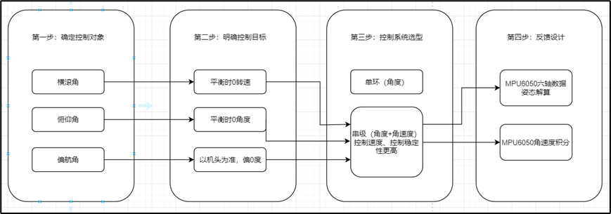

# Quadcopter-drone

### 1.1 项目概述

本项目是基于STM32的微型四轴无人机，相较于中大型四轴无人机，微型四轴无人机具有成本低、事故代价低、结构简单和量产率高等优势。控制核心采用STM32F103C8T6，姿态运动传感器选择MPU6050。无人机通过Si24R1（NRF24L01）与控制器进行2.4G无线通信，实现了即时有效地接收控制器指令，通过串级PID进行姿态控制，从而在空间中实现自由移动。

### 1.2 功能描述

### 1.2.1 姿态控制

通过MPU6050获取三轴加速度和三轴角速度，经过四元数姿态解算得到三种倾角。利用串级PID算法控制四轴无人机平衡状态。

### 1.2.2 实时操作系统

##### 移植FreeRTOS实现多任务调度和管理。

### 1.2.3 数据显示

把测得电池电压、摇杆大小、2.4G信道数据实时显示在液晶屏幕上。

### 1.2.4 遥控控制

遥控板与飞控板通过2.4G信号交互，发送指令，控制四轴无人机上升下降、前进后退、左右移动。

## 1.3 系统总体设计

1）飞控板主要硬件

MCU：STM32F103C8T6

传感器：MPU6050六轴传感器

2.4G通讯：Si24R1国产

螺旋桨：带有刷电机，X型布局

电池：3.7V，2000mAh

其他：开关、LED等

2）遥控板主要硬件

MCU：STM32F103C8T6

2.4G通讯：Si24R1国产

显示屏：12864OLED

摇杆：左油门，右方向

按键：微调、对频

电池：3.7V，2000mAh

其他：开关、LED等

## 1.4 飞控相关理论

### 1.1.1 常用姿态解算

| **方法**             | **描述**                                                     | **优点**                                                     | **缺点**                                           |
| -------------------- | ------------------------------------------------------------ | ------------------------------------------------------------ | -------------------------------------------------- |
| 角速度积分（欧拉角） | 类似二维平面上∠θ =ω *t。 利用三维旋转矩阵映射到三维时空。    | 原理和运算量都简单，稳定性好                                 | 长时间积分会出现积分偏差。欧拉角存在万向锁的问题。 |
| 加速度解算           | 类似二维平面反三角函数∠θ  =arctan(a 对边/b 临边)。三维旋转矩阵映射到三维时空 | 原理简单好理解                                               | 容易受振动影响                                     |
| 互补解算             | 由于单一传感器获得角度都有缺点，那就综合上述二者             | 综合了上述两者的优点                                         | 会受振动影响，并且动态性能差，大角度变化反应慢     |
| 四元数姿态解算       | 通过某个固定的算法得到角度                                   | 算法固定，数学理论 成熟，解算准确，计 算量小，效果直逼卡 尔曼 | 会受振动影响，角度回复有延迟。算法不容易理解       |
| 卡尔曼姿态评估       | 所谓评估就是综合某些因素，去估计姿态，就如同一部车驶来，你会根据它的速度评估下一秒的位置。 | 动态性能好                                                   | 模型复杂，计算量大， 理论复杂。参数 难调           |

## 1.5 PID控制算法

​			P：比例   回复力（修正 误差）

​			I：积分	累计和  （修正 静态误差）

​			D：微分  变化率 （阻力）

**内环是外环的微分**

```markdown
PID = p*偏差 + I*偏差的积分 + D*偏差的变化率 //偏差 = （实际值 - 期望值）
/**** PID控制器
* @param p  比例系数
* @param i  积分系数
* @param d  微分系数
* @param setPoint  设定值
* @param feedback  实际值
* @return 控制量
*/
float PID(float p,float i,float d,float setPoint,float feedback)
{
    static float errLast = 0; //上一次的偏差
    static float integral = 0; //积分和
    float err = setPoint - feedback; //当前偏差
    integral += err; //累计偏差
    float dErr = err - errLast; //偏差变化率
    errLast = err; //更新偏差
    return p*err + i*integral + d*dErr; //返回控制量
}
```

```

```



## 1.6周期控制

使用FreeRTOS控制的周期中，发送的周期一定要大于接收的周期

## 2.0驱动层

（1）IIC：用于MPU6050

（2）SPI：用于2.4G模块和OLED

（3）ADC：采集4个摇杆和电池电压

（4）定时器：PWM输出控制螺旋桨电机

（5）USART：方便打印调试

（6）GPIO：按键

## 2.1硬件接口层有哪些硬件

（1）MPU6050：获取三轴角速度、加速度

（2）8520空心杯电机：有刷、直流，4个螺旋桨X型布局。

（3）Si24R1：2.4G无线通信模块

（4）摇杆、按键

## 3.0应用层做了那些事情

（串级PID）串级PID就是在原先的PID控制块的前面再接一个PID控制块，叫做外环，内外环串接起来就是大概下面这个样子。外环PID想要直接获取到当前的位移是比较困难的，所以做下面的处理来间接获取

https://s2.51cto.com/images/blog/202108/09/2dce1b6169f640ad6a30596d6a0f48ef.jpeg?x-oss-process=image/watermark,size_16,text_QDUxQ1RP5Y2a5a6i,color_FFFFFF,t_30,g_se,x_10,y_10,shadow_20,type_ZmFuZ3poZW5naGVpdGk=/format,webp

**1）*****\*姿态计算\****

（1）MPU6050原始数据处理转换（这里MPU直接读取到角速度的值，所以角速度是最快得到的，角速度反应高于加速度，所以选择反应快，受干扰小的角速度做内环）。

（2）零偏校准。

（3）三轴加速度简易卡尔曼滤波。

（4）三轴角速度一阶低通滤波（给解算四元数提供数据）。

（5）四元数解算得到欧拉角（俯仰角，偏航角，横滚角）//三维空间的四个数据，代表空间和运动的趋时。

**2）*****\*串级PID\****

（1）内环：角速度环

（2）外环：角度环

三个欧拉角都进行串级PID处理，根据螺旋桨控制的方向，叠加在4个螺旋桨的PWM。

**3）*****\*摇杆和按键处理\****

（1）ADC读取4个摇杆数据，转换、滑动窗口滤波、限幅。

（2）左按键中点校准：长按按键，进行摇杆中点值校准。

**4）*****\*无线遥控\****

（1）根据自定义通信协议，封装遥控数据成数据帧。

（2）遥控板通过2.4G发送，飞控板通过2.4G接收。

（3）飞控板解析数据，进行校验、指令判断。

（4）添加失联处理：2.4G失联自动缓慢落地、尝试重连。

**5）*****\*数据显示逻辑\****

（1）显示信道号。

（2）显示4个摇杆的幅度大小。
